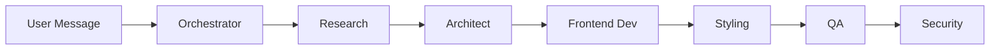
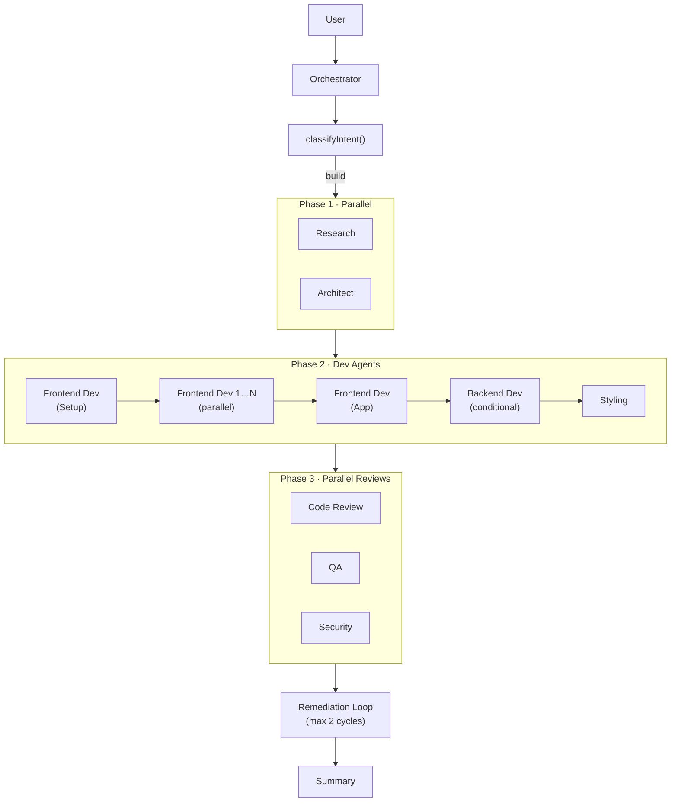
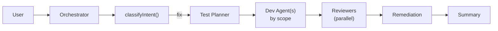

# ADR-002: Agent Architecture

## Status
Accepted — Superseded by implementation (see notes below)

## Date
2026-02-18

## Context
Need a multi-agent system where specialized AI agents collaborate to build web pages. Key requirements:
- Pipeline with error halting
- Per-agent model assignment (different models for different tasks)
- Token tracking per request
- Retry logic with configurable max retries
- Resume from interrupted state

## Original Decision (v1 — sequential)

The initial architecture used a strictly sequential pipeline:

This was simpler to implement but slower.

## Current Implementation (v2 — parallelized)

The architecture has evolved significantly since the original decision:

### Intent-Based Routing
The orchestrator classifies each message into `build`, `fix`, or `question` via a cheap Haiku call, then routes to the appropriate pipeline.

### Parallelized Pipeline (build mode)

### Fix Pipeline

### Architecture
- **Base agent function** (`runAgent`) wraps AI SDK 6 `streamText` calls with native tool use
- **Agent registry** defines 10 base agents + 3 orchestrator subtasks
- **Orchestrator** creates a dependency-aware execution plan with batch scheduling
- **Dependency-aware batching:** Steps whose `dependsOn` are all completed run concurrently; halts on first failure
- **Token tracker** records every API call with agent, provider, model, key hash
- **Cost limiter** checks token usage after each batch
- **Tiered fix pipeline:** Build errors → targeted dev agent fix → re-check

### Agents (13 total)
| Agent | Model | Provider |
|-------|-------|----------|
| Orchestrator | claude-sonnet-4-6 | Anthropic |
| orchestrator:classify | claude-haiku-4-5-20251001 | Anthropic |
| orchestrator:summary | claude-sonnet-4-6 | Anthropic |
| orchestrator:question | claude-sonnet-4-6 | Anthropic |
| Research | claude-sonnet-4-6 | Anthropic |
| Architect | claude-sonnet-4-6 | Anthropic |
| Frontend Dev | claude-sonnet-4-6 | Anthropic |
| Backend Dev | claude-sonnet-4-6 | Anthropic |
| Styling | claude-sonnet-4-6 | Anthropic |
| Test Planner | claude-sonnet-4-6 | Anthropic |
| Code Review | claude-sonnet-4-6 | Anthropic |
| QA | claude-sonnet-4-6 | Anthropic |
| Security | claude-haiku-4-5-20251001 | Anthropic |

### Error Handling
- Agent failure immediately halts the pipeline
- Up to 3 automatic retries before halting
- Each execution is recorded in `agent_executions` table
- Failed state is surfaced to user via WebSocket
- Remediation loop exits early if issues aren't improving between cycles

## Alternatives Considered
- **~~Parallel agent execution:~~ Now implemented.** Dependency-aware batching with parallel frontend-dev instances solves the merge conflict risk via the App-last pattern.
- **Single monolithic agent:** Less specialized, harder to debug/iterate
- **LangChain:** Heavier abstraction, less control than AI SDK 6

## Consequences
- Parallelized execution is faster (Research + Architect run simultaneously, reviewers run simultaneously)
- Each agent can be tested/iterated independently
- Token tracking gives full visibility into costs
- Error halting prevents cascading failures
- Dependency-aware batching adds complexity but the orchestrator handles it transparently
