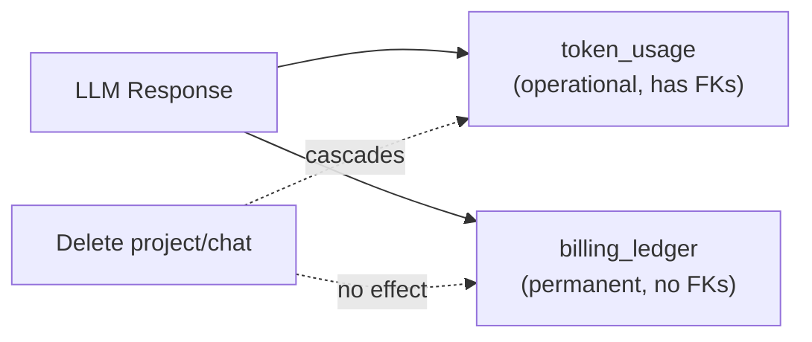
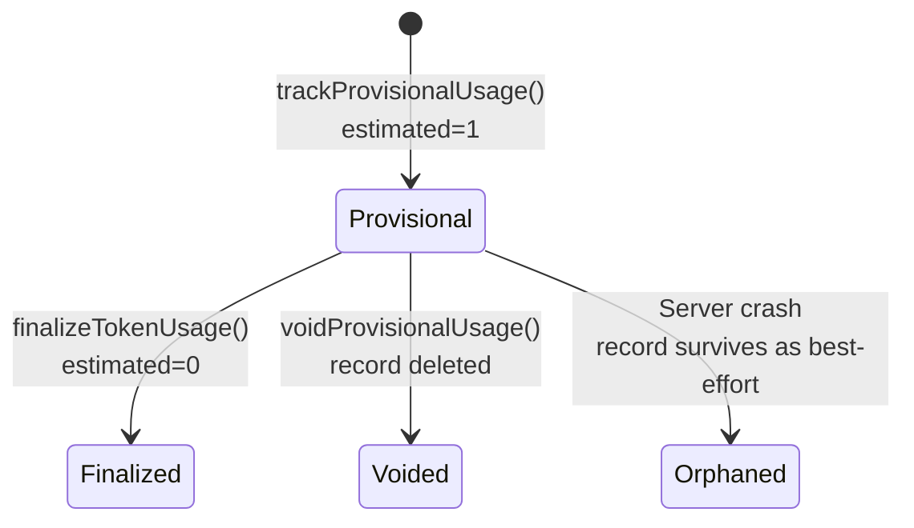

# ADR-003: Token Accounting & Cost Safety

## Status
Accepted

## Date
2026-02-20

## Context

Running multi-agent LLM pipelines is expensive. A single build pipeline can invoke 8+ agents, each consuming thousands of tokens. Without guardrails, a runaway pipeline or crashed server could burn through API credits silently. We needed:

- Accurate cost tracking that survives project/chat deletion
- Crash-safe billing (no lost records if server dies mid-pipeline)
- Multiple layers of cost controls to prevent runaway spend
- Minimal prompt size per agent to reduce token waste

## Decisions

### 1. Dual-Write Billing (token_usage + billing_ledger)

Every token usage event writes to **two tables**:

- **token_usage** has foreign keys to `chats` and `agent_executions`. Deleted when parent entities are deleted. Powers active session dashboards.
- **billing_ledger** has no foreign keys. Stores denormalized `project_name` and `chat_title` snapshots. Never deleted. Powers lifetime billing views.

A third function, `trackBillingOnly()`, writes only to `billing_ledger` for system calls (e.g., API key validation) that have no matching chat/execution records.

**Key files:** `src/server/services/token-tracker.ts`, `src/server/db/schema.ts`

### 2. Write-Ahead Token Tracking

To handle server crashes mid-pipeline, all LLM calls use a two-phase pattern:

- **Before the call:** Insert provisional records with `estimated=1` and estimated tokens (input chars / 4, output = 30% of input).
- **After success:** Update records with actual token counts, set `estimated=0`.
- **On failure:** Delete provisional records (no phantom billing).
- **On crash:** Provisional records remain — `/usage/summary` reports `estimatedTokens` separately.

**Key files:** `src/server/services/token-tracker.ts` (`trackProvisionalUsage`, `finalizeTokenUsage`, `voidProvisionalUsage`)

### 3. Layered Cost Limiter

Cost limits are checked at four independent layers:

| Layer | When | What | Threshold |
|-------|------|------|-----------|
| **Pre-flight** | Before each agent | Estimated input tokens vs. session limit | 95% of limit (5% buffer) |
| **Post-batch** | After each batch completes | Actual session token total | 100% of limit |
| **Daily** | After each batch | Sum of billing_ledger today | Configurable (default unlimited) |
| **Per-project** | After each batch | Sum of billing_ledger for project | Configurable (default unlimited) |

Additional safeguard: `maxAgentCallsPerRun` (default 30) hard-caps total agent invocations per pipeline to prevent infinite loops.

Warning at 80% of session limit. Hard stop at 100% — pipeline is marked `interrupted` (resumable after increasing limits).

**Key files:** `src/server/services/cost-limiter.ts`, `src/server/agents/orchestrator.ts`

### 4. Upstream Output Filtering

Each agent receives only the upstream data it needs, via `filterUpstreamOutputs()`:

| Agent | Receives | Skips |
|-------|----------|-------|
| frontend-dev | architect, research, design-system | everything else |
| backend-dev | architect, research | everything else |
| styling | architect, design-system | dev outputs, research |
| code-review, security, qa | architect, changed-file manifest, project source (30K cap) | full dev outputs |
| remediation agents | architect, review findings | project-source (agents have read_file tool) |
| re-review agents | architect, fresh source from disk | stale cached source |

Additional token reduction:
- Dev agent outputs converted to compact file manifests for reviewers
- Project source capped at 40K chars (architect), 30K (reviewers)
- Smart truncation: keeps start + end, elides middle
- Chat history capped at last 6 messages, 3K chars total

**Key files:** `src/server/agents/orchestrator.ts` (`filterUpstreamOutputs`, `truncateOutput`, `buildFileManifest`)

## Alternatives Considered

- **Single billing table:** Simpler, but deleting a project loses all cost history. Unacceptable for a tool that tracks real money.
- **No provisional tracking:** Simpler, but a crash after a $2 Opus call would silently lose that record.
- **Single cost check point:** Simpler, but a single check after each agent can't prevent overshooting (large prompts can blow past the limit in one call).
- **Send all upstream to every agent:** Simpler, but 5-10x more tokens per downstream agent. The filtering function has ~10 special cases, but the cost savings are worth the complexity.

## Consequences

- Billing data is never lost, even after deletion or server crash
- Users get defense-in-depth cost protection at four independent layers
- Downstream agents see ~80% fewer prompt tokens than a naive "send everything" approach
- Dual-write and provisional tracking add complexity to every LLM call site
- The upstream filtering function is the most complex part — 10+ routing rules that must stay in sync with pipeline changes
