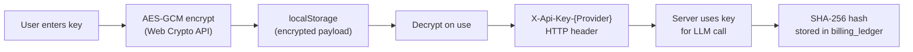

# ADR-004: Client-Side Security Model

## Status
Accepted

## Date
2026-02-20

## Context

The app requires API keys for Anthropic, OpenAI, and Google. These keys give direct access to paid services and must be handled carefully. As a local-first application, we need to decide where keys live, how they're protected, and what the server knows about them.

## Decision

### API Keys Never Touch the Server Database



- **Storage:** Client-side only, in `localStorage`, encrypted with AES-GCM 256-bit.
- **Encryption key:** Generated once per device via `crypto.subtle.generateKey()`, stored in IndexedDB (`jbi-keystore` database, `keys` store). Non-extractable.
- **Payload format:** `{ v: 1, iv: <base64 12-byte IV>, data: <base64 ciphertext> }`
- **Transport:** Sent per-request via `X-Api-Key-Anthropic`, `X-Api-Key-OpenAI`, `X-Api-Key-Google` headers.
- **Server-side:** Key is used for the LLM call, then only its SHA-256 hash is persisted (in billing records for audit grouping). The plaintext key is never written to disk or database.
- **Fallback:** If Web Crypto or IndexedDB is unavailable (older browsers, restrictive policies), keys are stored as plaintext in `localStorage` with a console warning.

### Proxy URL Support

Each provider supports an optional proxy URL (stored alongside the key in encrypted localStorage). When set, LLM calls are routed through the proxy instead of the provider's direct API. This supports self-hosted deployments and corporate proxies.

### Preview Iframe Sandboxing

Generated project previews run in an iframe with restricted permissions:

```
sandbox="allow-scripts allow-same-origin allow-forms"
```

This prevents generated code from accessing the parent app's localStorage (where keys live), cookies, or DOM.

### Docker Read-Only Source

In Docker mode, the application source is bind-mounted as read-only (`.:/app:ro`). Generated project files write to a separate `./projects` volume. This prevents generated code from modifying the application itself.

**Key files:** `src/client/lib/crypto.ts`, `src/client/lib/api.ts`, `src/client/stores/settingsStore.ts`, `src/server/providers/registry.ts` (`hashApiKey`)

## Alternatives Considered

- **Server-side key storage (encrypted in DB):** More traditional, but violates local-first principle. Server becomes a high-value target. Client can't rotate keys independently.
- **Environment variables:** Standard for server apps, but this is a local dev tool. Users shouldn't need to restart the server to change keys.
- **Session-only storage (no persistence):** Safest, but terrible UX — re-entering 3 API keys every session.
- **No encryption (plaintext localStorage):** Simplest. We still support this as a fallback, but encrypt by default because localStorage is readable by any JS on the same origin.

## Consequences

- Server has zero key persistence — no breach vector for stored credentials
- Key rotation is instant — client-only, no server restart
- Works offline after initial key entry
- Fallback to plaintext ensures the app works everywhere, even if Web Crypto is unavailable
- SHA-256 hashes in billing records allow grouping usage by key without exposing the key
- Generated code in the preview iframe cannot access parent app state
