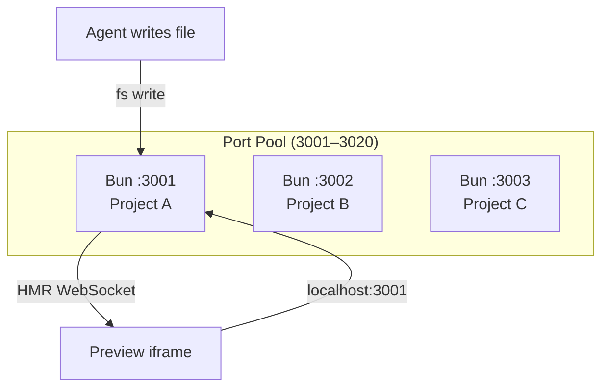
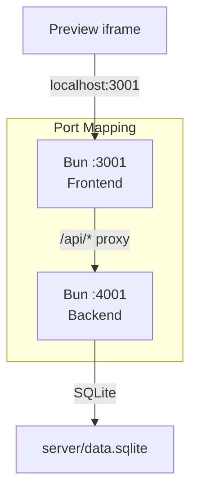
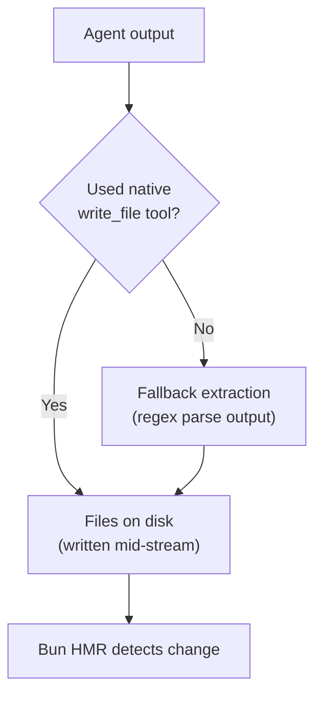
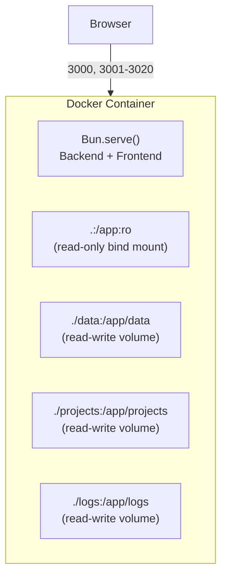

# ADR-005: Preview Isolation & Docker Sandboxing

## Status
Accepted (updated 2026-03-01: Vite → Bun dev server)

## Date
2026-02-20

## Context

Agents generate and execute arbitrary code in real time. Users see live previews of generated projects while agents are still writing files. This requires:

- Isolated preview environments per project
- Safe execution of untrusted generated code
- Live HMR updates as agents write files
- Optional full containerization for defense-in-depth

## Decisions

### 1. Per-Project Bun Dev Servers

Each active project gets its own Bun dev server on a unique port:

- **Port pool:** 3001–3020 (max 20 concurrent previews). Stopped servers release their port back to the pool.
- **On-demand startup:** Server is spawned lazily when the preview component mounts, via `Bun.spawn(["bun", "./index.html", "--port", port])`.
- **Auto-scaffolding:** Before starting the dev server, the system ensures `package.json`, `bunfig.toml`, `index.html`, and `src/main.tsx` exist. Agent-specified dependencies are merged, not overwritten.
- **Per-project mutex:** Prevents concurrent `bun install` on the same project directory.
- **Cleanup:** Servers are killed when the project is closed or the app exits.

### 1b. Per-Project Backend Servers

Projects that include a `server/index.ts` entry point get a backend process alongside the frontend:

- **Port derivation:** `backendPort = frontendPort + 1000`. E.g., frontend on 3005 → backend on 4005. No separate port pool needed.
- **Framework:** Hono (already in `package.json`), running on Bun. Entry point: `server/index.ts`.
- **Startup:** Eagerly started by the orchestrator after a successful build check, when `server/index.ts` exists on disk.
- **Health check:** Polls `GET /api/health` every 500ms for up to 10s. Once ready, `enableBunProxy()` scaffolds a `dev-server.ts` wrapper with `/api` proxy pointing at the backend port.
- **Persistence:** SQLite only via `bun:sqlite`. Data file at `server/data.sqlite` (per-project, zero cross-project conflicts). No external services (Redis, Postgres, etc.) allowed.
- **Lifecycle:** Mirrors frontend server exactly — `proc.exited` handler auto-cleans up on crash. Explicitly stopped when project is deleted or preview is stopped.
- **Frontend-only projects:** No backend process spawned, no proxy scaffolded, no changes at all.

**Key files:** `src/server/preview/backend-server.ts`, `src/server/preview/preview-server.ts` (`enableBunProxy`, `getFrontendPort`)

### 2. Pipeline-Aware Preview Gating

The preview doesn't blindly reload on every file change:

| Event | Pipeline running | Pipeline idle |
|-------|-----------------|---------------|
| `files_changed` | Ignored (agents mid-write) | Reload as fallback |
| `preview_ready` | Always reload | Always reload |

`preview_ready` is only broadcast after a successful `bun build` check. This prevents the preview from flashing broken/partial content while agents are still writing files.

### 3. Hybrid File Extraction (Native Tools + Text Fallback)

Agents write files via two mechanisms:

- **Primary:** AI SDK native `write_file` tool — files hit disk during generation, Bun picks them up immediately.
- **Fallback:** If the model outputs `<tool_call>` XML in text instead of using native tools, `extractAndWriteFiles()` parses and writes them. Files already written natively are skipped (tracked via `alreadyWritten` set).
- **JSON repair:** Common encoding issues (literal `\n`, tabs, BOM) are auto-repaired before falling back to regex extraction.
- **Logging:** Warnings are logged when fallback extraction triggers, indicating a model/prompt issue.

### 4. Docker Containerization (Optional)

For users who want full sandboxing, Docker wraps the entire application:

- **Source is read-only:** Application code is bind-mounted as `:ro`. Generated code cannot modify the app itself.
- **Data isolation:** SQLite database, project files, and logs each get their own writable volume.
- **Network:** Ports 3000 (API + frontend), 3001–3020 (preview dev servers), and 4001–4020 (preview backend servers) are mapped.
- **Host binding:** `PREVIEW_HOST=0.0.0.0` ensures preview servers bind to all interfaces inside the container (browser connects via Docker port mapping).
- **Log format:** `LOG_FORMAT=json` by default in Docker for machine-parseable output.
- **Multi-stage Dockerfile:** `dev` target for development (bind-mounted source), `production` target for deployment (compiled frontend, production deps only).

**Key files:** `src/server/preview/preview-server.ts`, `src/server/preview/backend-server.ts`, `src/server/agents/orchestrator.ts` (`extractAndWriteFiles`), `Dockerfile`, `docker-compose.yml`

## Alternatives Considered

- **Single shared dev server for all projects:** Simpler, but requires complex routing, shared bundle cache, and HMR channel multiplexing. Per-project servers are cleaner and truly isolated.
- **Vite dev servers (previous approach):** Worked but required a two-process architecture (separate Vite + Bun backend), port 5173 for the main frontend, `/api` proxy config, and WebSocket port-sniffing hacks. Bun's built-in dev server eliminates all of this.
- **Native tools only (no fallback extraction):** Simpler, but models sometimes fail to use tools correctly (output token limits, poor instruction following). The fallback prevents lost work.
- **Always require Docker:** Safer, but adds friction for local dev. Docker is optional for users who want sandboxing but not required for basic use.
- **WebContainers (in-browser execution):** No server needed, but limited to browser APIs. Can't run `bun install` or arbitrary Node.js code.

## Consequences

- Each project is fully isolated — different ports, separate HMR channels, independent dependency installs
- Preview never shows broken state thanks to pipeline-aware gating + build checks
- Hybrid extraction ensures files are captured even when models misbehave
- Docker provides defense-in-depth with read-only source and isolated volumes
- Per-project servers use more memory (~20MB each) but the port pool caps concurrency at 20
- The fallback extraction path adds regex complexity but is well-logged for debugging
