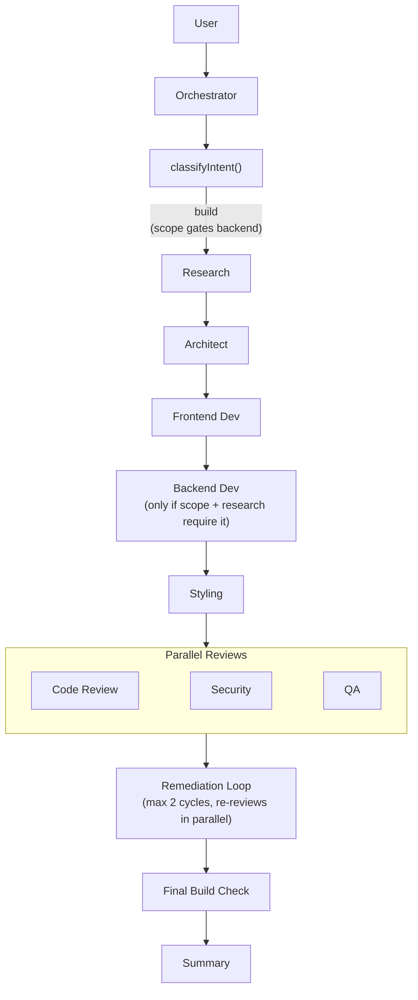
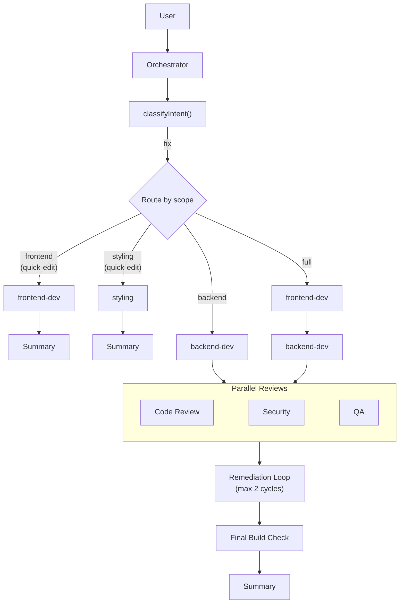
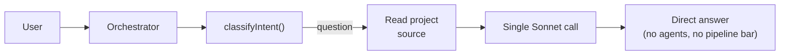

# Agent Roster

## Overview

The system uses 13 agent configs (9 base agents + 4 orchestrator subtasks), coordinated by an orchestrator. Each agent has a specific role, model, and set of tools. All models are configurable via **Settings → Models**.

## Agents

### 1. Orchestrator
- **Model:** Claude Sonnet 4.6 (Anthropic) for agent dispatch
- **Subtask models** (configurable via Settings → Models):
  - **Intent Classifier** (`orchestrator:classify`) → default Haiku ($1/$5 per MTok)
  - **Chat Titler** (`orchestrator:title`) → default Haiku ($1/$5 per MTok)
  - **Summary Writer** (`orchestrator:summary`) → default Sonnet 4.6 ($3/$15 per MTok)
  - **Question Answerer** (`orchestrator:question`) → default Sonnet 4.6 ($3/$15 per MTok)
- **Role:** Creates execution plan, dispatches agents, synthesizes a single summary, handles errors/retries
- **Tools:** Agent dispatch, version creation
- **Key behaviors:** Halts on error, supports retry, resumes from existing state
- **Output:** After all agents complete, the orchestrator generates a clean markdown summary of what was built. This is the only message the user sees — individual agent outputs are collected internally and never shown directly in chat.

### 2. Research Agent
- **Model:** Claude Sonnet 4.6 (Anthropic)
- **Role:** Analyzes user request, identifies requirements
- **Output:** Structured JSON requirements document (includes `requires_backend` per feature for conditional pipeline)
- **Tools:** None — receives user prompt only, outputs requirements

### 3. Architect Agent
- **Model:** Claude Sonnet 4.6 (Anthropic)
- **Role:** Designs component tree, file structure, data flow, and test plan
- **Output:** Component hierarchy, file plan, dependency list, and `test_plan` section (build mode only)
- **Tools:** None — receives research output, produces architecture doc with embedded test specs

### 4. Frontend Developer
- **Model:** Claude Sonnet 4.6 (Anthropic)
- **Role:** Generates React/HTML/CSS/JS code and writes test files alongside components
- **Tools:** `write_file`, `read_file`, `list_files` — native AI SDK tools executed mid-stream
- **Test responsibility:** Writes vitest test files alongside components, following the test plan from the architect
- **Single instance (build mode):** A single frontend-dev agent handles all component files defined in the architect's plan.

### 5. Backend Developer
- **Model:** Claude Sonnet 4.6 (Anthropic)
- **Role:** Generates Hono API routes, SQLite persistence, and server logic in the `server/` directory
- **Framework:** Hono on Bun. Entry point: `server/index.ts`. All routes under `/api/`. Persistence via `bun:sqlite` only.
- **Tools:** `write_file`, `read_file`, `list_files` — native AI SDK tools executed mid-stream
- **Test responsibility:** Writes vitest test files alongside server modules, following the test plan
- **Note:** Only runs when the research agent identifies features requiring a backend (`requires_backend: true`). The preview system automatically spawns the backend process and proxies `/api/*` from Vite.

### 6. Styling Agent
- **Model:** Claude Sonnet 4.6 (Anthropic)
- **Role:** Applies design polish, responsive layout, theming
- **Tools:** `write_file`, `read_file`, `list_files` — native AI SDK tools executed mid-stream

### 7. Code Reviewer
- **Model:** Claude Sonnet 4.6 (Anthropic)
- **Role:** Reviews code for bugs, type errors, and correctness; reports issues for dev agents to fix
- **Tools:** None — read-only, report only
- **Output:** Structured JSON report with `status: "pass" | "fail"`, categorized findings (`[frontend]`, `[backend]`, `[styling]`)

### 8. QA Agent (Requirements Validator)
- **Model:** Claude Sonnet 4.6 (Anthropic)
- **Role:** Validates implementation against research requirements; reports gaps without fixing code
- **Tools:** None — read-only, report only
- **Output:** Structured JSON report with `status: "pass" | "fail"`, requirements coverage, and categorized issues (`[frontend]`, `[backend]`, `[styling]`)

### 9. Security Reviewer
- **Model:** Claude Haiku 4.5 (Anthropic)
- **Role:** Scans for XSS, injection, key exposure
- **Output:** Security report (pass/fail with findings)
- **Tools:** None — reviews code from previous agent outputs

## Pipeline

### Intent-Based Routing

Before running the pipeline, the orchestrator classifies the user's message into one of three intents:

| Intent | Scope | Pipeline |
|--------|-------|----------|
| **build** | any | Full pipeline (research → architect → devs → styling → reviewers) |
| **fix** | `styling` or `frontend` | Quick-edit: single dev agent → summary (no reviewers) |
| **fix** | `backend` | backend-dev → reviewers |
| **fix** | `full` | frontend-dev → backend-dev → reviewers |
| **question** | — | Direct Sonnet answer with project context, no pipeline |

Classification uses a ~100-token Haiku call (cheap, fast) with 5 few-shot examples and a tie-breaking rule (prefer "fix" when project has files). Fast-path: empty projects always get "build" (no API call needed).

### Build Pipeline



**Sequential Research → Architect:** Research runs first so the architect receives structured requirements. The architect then produces the component architecture, design system, and test plan.

**Design system passthrough:** The architect's output includes a `design_system` JSON field (colors, typography, spacing, radius, shadows). The orchestrator's `injectDesignSystem()` extracts this and injects it into the upstream outputs for frontend-dev and styling agents, ensuring consistent design language across all generated code.

### Fix Pipeline



Quick-edit paths (`frontend`, `styling`) use a single dev agent with no reviewers — the agent uses `list_files` + `read_file` for targeted edits instead of receiving a full project source dump.

**Smart test re-runs:** When tests fail and a dev agent fixes the code, only the failed test files are re-run (specific file paths passed to vitest) instead of the full suite, saving 3-10s per fix cycle.

### Question Mode



### Parallelization Details

The pipeline executor uses dependency-aware batch scheduling:
- Steps whose `dependsOn` are all in the completed set run concurrently as a batch
- When a batch completes, newly unblocked steps form the next batch
- Halts on first failure within any batch
- Cost limit checked after each batch completes

**Dependency chain in build mode:**
- `frontend-dev` depends on `architect`
- `backend-dev` depends on `frontend-dev` (only included if scope + research require it)
- `styling` depends on all dev agents — waits for all to complete
- `code-review`, `security`, and `qa` all depend on `styling` — run in parallel as a batch

**Remediation re-reviews** also run in parallel (`Promise.all` for code-review, security, qa).

### Pipeline Plan Broadcasting

The orchestrator broadcasts a `pipeline_plan` WebSocket message at the start of each pipeline. The client uses this to dynamically render only the relevant agents in the status bar:
- Build mode: shows all pipeline agents
- Fix mode: shows only the dev agent(s) + reviewers
- Question mode: hides the pipeline bar entirely, shows a "Thinking..." indicator

### General Pipeline Behavior

- Each agent's output is collected internally by the orchestrator (not saved as a chat message).
- Agent execution records are still saved to the `agentExecutions` table for debugging and the status panel.
- After the pipeline completes, the orchestrator calls Sonnet to generate a single markdown summary (agent outputs are truncated to 500 chars each in the digest).
- Only this summary is saved as a chat message and shown to the user.
- The pipeline halts immediately on any agent failure. Up to 3 retries are attempted before halting.
- All WebSocket messages include `chatId` so multiple chats can run simultaneously without cross-talk.

### Conditional Backend

Backend-dev inclusion is gated by two checks:

1. **Scope gate:** If the intent classifier sets scope to `frontend` or `styling`, backend-dev is skipped regardless of research output. This prevents false positives like "no backend needed" triggering the backend agent.
2. **Research gate:** The research agent outputs `requires_backend: true/false` per feature in its JSON requirements. The orchestrator's `needsBackend()` function checks this flag (with a regex heuristic fallback) to decide whether to include backend-dev.

Both must agree — scope must allow it AND research must indicate it.

### Remediation Loop

After the initial code-review, security, and QA agents run, the orchestrator checks their output for issues using `detectIssues()`. If issues are found:

1. **Route findings** to the correct dev agent(s) based on `[frontend]`/`[backend]`/`[styling]` tags from code-review and QA output. Defaults to frontend-dev when no clear routing.
2. **Dev agent(s)** receive the findings and output corrected files
3. **Re-review agents run in parallel:** Code Reviewer, Security Reviewer, and QA Agent all re-evaluate simultaneously
4. If issues persist, the loop repeats (max 2 cycles)

Each cycle checks the cost limit before proceeding. The loop exits early if:
- All issues are resolved (code-review passes + security passes + QA passes)
- Issues are not improving between cycles (prevents ping-pong loops)
- Total agent call limit reached (configurable via Settings → Limits, default 30)
- Cost limit is reached
- The pipeline is aborted by the user
- A remediation or re-review agent fails

**Key design principle:** Only dev agents (frontend-dev, backend-dev, styling) write code. All review agents (code-review, security, qa) are read-only reporters. This prevents two agents from fighting over the same files.

In the UI, re-review agents show their cycle number (e.g., "Code Reviewer (re-review #1)") so the user can track the iteration.

### Thinking Block History

When remediation routes back to an agent that already ran (e.g., frontend-dev runs again to fix review findings), the UI **appends a new thinking block** instead of replacing the original. This preserves the full history so users can see both the original output and the remediation output.

Blocks are identified by unique IDs. The `toggleExpanded` action targets blocks by ID, not agent name, so expanding one "Frontend Developer" block doesn't affect others.

### Inline Test Results

Test results appear **inline in the thinking block timeline** at the point where tests ran, rather than as a separate banner at the bottom. This makes it clear which dev agent's output triggered the test run. The `TestResultsBanner` component is rendered inside `AgentThinkingMessage` when a block has `blockType: "test-results"`.

### Native Tool Use

Agents use the AI SDK's native `tool()` definitions instead of text-based `<tool_call>` XML. This enables:

- **Mid-stream file writes:** `write_file` executes during generation — files hit disk immediately, Vite HMR picks up changes
- **File reading:** `read_file` lets agents inspect existing code (especially useful in fix mode)
- **Project exploration:** `list_files` lets agents discover the project structure
- **Clean thinking blocks:** Agent reasoning text contains only thoughts, not code dumps
- **Cross-provider compatibility:** Works identically across Anthropic, OpenAI, and Gemini via AI SDK abstraction

**Fallback extraction:** If an agent outputs `<tool_call>` XML in its text instead of using native tools, `extractAndWriteFiles()` still parses and writes those files. Files already written natively are skipped (tracked via `alreadyWritten` set). A warning is logged when fallback extraction is triggered.

**Tool-use loop limit:** `stopWhen: stepCountIs(N)` prevents runaway tool-use loops. Dev agents (frontend-dev, backend-dev, styling) have 8 steps; all other tool-using agents default to 10 steps. Agents without tools don't get `stopWhen` applied.

**Output token caps:** Each agent has a hard `maxOutputTokens` limit to prevent verbose output:
- frontend-dev: 64,000 tokens (large multi-file writes with many components)
- backend-dev: 32,000 tokens (multi-file server code)
- styling: 32,000 tokens (bulk style changes across many files)
- architect: 12,000 tokens (large JSON architecture doc — truncation breaks file_plan parsing)
- research: 3,000 tokens
- Review agents (code-review, security, qa): 2,048 tokens each
- Default (all others): 8,192 tokens

### File Extraction (Hardened, Fallback)

The fallback extraction pipeline handles agents that don't use native tools:
1. Agents include `<tool_call>` blocks with `write_file` in their text output
2. The orchestrator's `extractAndWriteFiles()` parses these tool calls from the output
3. **JSON repair step:** When `JSON.parse` fails, the extractor first attempts to repair common issues (literal newlines, tabs, BOM characters) before falling back to regex. Warnings are logged for debugging.
4. **Content normalization:** All extracted content is cleaned (BOM stripped, CRLF→LF, CR→LF)
5. File paths are sanitized (strip leading quotes/backticks, normalize separators)
6. Files are written to the project directory via `file-ops.ts`
7. A `files_changed` WebSocket event is broadcast so the UI updates

### Upstream Output Filtering

Agents only receive relevant upstream data via `filterUpstreamOutputs()`, reducing prompt size:
- `frontend-dev` → `architect` + `research` + `design-system`
- `backend-dev` → `architect` + `research`
- `styling` → `architect` + `design-system`
- Review agents (`code-review`, `security`, `qa`) → dev agent outputs only (they need the code)
- Remediation/build-fix/re-review phases receive all outputs (full context needed)

Quick-edit optimization for `fix` requests:
- `scope=styling|frontend` runs a single dev agent and does **not** preload `project-source`
- The agent is instructed to use `list_files` + `read_file` for targeted edits
- This avoids sending large source dumps for small changes (for example, color tweaks)

### Build Check Pipeline

After each file-producing agent (frontend-dev, backend-dev, styling), the orchestrator:
1. Runs `bunx vite build --mode development` to check for compile errors
2. Build errors are **deduplicated** by core pattern and capped at 10 unique errors (e.g., `[3x] Cannot find module '@/utils'`)
3. If errors are found, routes them to the appropriate dev agent (backend-dev for server file errors, frontend-dev otherwise)
4. Test failures are capped at 5 per fix attempt with a truncation message
5. Only broadcasts `preview_ready` after a successful build
6. The preview pane updates live once the build passes

## Token Tracking

Every API call records:
- Agent name
- Provider
- Model ID
- API key hash (SHA-256)
- Input/output tokens (non-cached)
- Cache creation tokens (Anthropic: billed at 1.25x input price)
- Cache read tokens (Anthropic: billed at 0.1x input price)
- Cost estimate (USD) — includes cache token pricing for accurate billing

## Agent Customization

Each agent's provider, model, and system prompt can be overridden via **Settings → Models** and **Settings → Prompts**.

- Overrides are stored in the `app_settings` table (keys: `agent.{name}.provider`, `agent.{name}.model`, `agent.{name}.prompt`)
- The orchestrator reads resolved configs (DB overrides layered on AGENT_ROSTER defaults) at runtime
- Custom prompts replace the default `.md` file prompts completely
- Resetting an agent removes all DB overrides, reverting to AGENT_ROSTER defaults
- Changes take effect on the next pipeline run — no restart required

### Supported Providers & Models

All provider/model configuration lives in a single file: **`src/shared/providers.ts`**. This is the source of truth for both client and server.

**6 providers**, **71 models** (as of Feb 2026):

| Provider | Models | Key models |
|----------|--------|------------|
| Anthropic | 8 | Opus 4.6, Sonnet 4.6, Haiku 4.5, legacy Opus 4.0/4.1 |
| OpenAI | 30 | GPT-5.2, 5.1, 5 families + Codex, o-series reasoning, TTS/audio/realtime |
| Google AI | 9 | Gemini 3.1/3/2.5 Pro/Flash/Lite, image preview, TTS |
| xAI (Grok) | 9 | Grok 4/4.1 Fast, Grok 3, code, vision |
| DeepSeek | 2 | deepseek-chat, deepseek-reasoner |
| Mistral AI | 14 | Large/Medium/Small, Devstral, Codestral, Pixtral, Magistral, Ministral |

Adding a new provider requires only 2 files:
1. `src/shared/providers.ts` — add provider def, models, pricing, cache multiplier, validation model
2. `src/server/providers/registry.ts` — add 1 line to `SDK_FACTORIES` + `npm install @ai-sdk/{provider}`

**Voice support:** Voice catalogs (OpenAI 13 voices, Google 30 voices, xAI 5 voices) are stored in `PROVIDER_VOICES`. Models with voice capability have a `voices` field indicating which voices they support.

**Note on non-text models:** Voice/TTS/realtime models are cataloged for future voice features but will error if assigned to a text agent. "Responses API only" models (gpt-5.2-pro, gpt-5-pro, o3-pro, o1-pro) may require framework changes to support.

### Tool Assignments

Each agent's native tool access can be configured via **Settings → Tools**. The four available tools are `write_file`, `write_files`, `read_file`, and `list_files`.

**Defaults:**
| Agent | write_file | write_files | read_file | list_files |
|-------|-----------|-------------|-----------|------------|
| frontend-dev, backend-dev, styling | Yes | Yes | Yes | Yes |
| research, architect, code-review, qa, security | No | No | No | No |
| orchestrator, orchestrator:classify, orchestrator:title, orchestrator:question, orchestrator:summary | No | No | No | No |

- Tool overrides are stored in `app_settings` (key: `agent.{name}.tools`, value: JSON array)
- The orchestrator reads tool config at runtime via `getAgentTools()` and only passes enabled tools to each agent
- Orchestrator is read-only — it never gets native tools
- `extractAndWriteFiles()` also respects tool config: agents without `write_file` skip fallback file extraction
- Resetting an agent's tools removes the DB override, reverting to the default
- Build checks and test runs only trigger for agents that have `write_file` enabled

## Model Category Restrictions

Each agent has an `allowedCategories` field that restricts which model categories can be assigned to it. This prevents assigning voice, image, or realtime models to text-only agents.

| Agent Group | Agents | Allowed Categories |
|-------------|--------|--------------------|
| Orchestrator subtasks | orchestrator, classify, title, question, summary | `text` |
| Planning | research, architect | `text`, `reasoning` |
| Development | frontend-dev, backend-dev, styling | `text`, `code`, `reasoning` |
| Quality | code-review, qa, security | `text`, `code`, `reasoning` |

- When `allowedCategories` is undefined (e.g., custom agents without restrictions), all categories are allowed.
- The model dropdown in Settings filters models by the agent's allowed categories — voice/image/realtime models simply won't appear for text agents.
- Server-side enforcement in `PUT /settings/agents/:name` rejects models whose category is not in the agent's allowed list.

## Custom Agents

The agent registry is extensible via a `custom_agents` database table. Custom agents integrate with the existing Settings UI and override system.

### Creating Custom Agents

**API:** `POST /settings/custom-agents`

```json
{
  "name": "my-agent",
  "displayName": "My Agent",
  "provider": "anthropic",
  "model": "claude-sonnet-4-6",
  "description": "What this agent does",
  "group": "custom",
  "allowedCategories": ["text", "code"],
  "prompt": "Custom system prompt...",
  "tools": ["write_file", "read_file"],
  "maxOutputTokens": 8192,
  "maxToolSteps": 10
}
```

**Name format:** Must match `/^[a-z][a-z0-9-]*$/` (lowercase, starts with letter, hyphens allowed). Cannot collide with built-in agent names.

### How Custom Agents Work

- **Config resolution:** Custom agents are self-contained rows in the `custom_agents` table. They appear in `getAllAgentConfigs()` alongside built-in agents.
- **System prompts:** Resolved in this order: (1) `app_settings` override, (2) `custom_agents.prompt` column, (3) generic fallback.
- **Tools & limits:** Stored in the `custom_agents` row. Can be overridden via `app_settings` like built-in agents.
- **Model assignment:** Uses the same `PUT /settings/agents/:name` endpoint. For custom agents, updates the `custom_agents` row directly instead of `app_settings`.
- **Settings UI:** Custom agents appear in a "Custom Agents" group section with a violet "custom agent" badge.

### Limitations

- Custom agents are not part of the hardcoded pipeline DAG (orchestrator.ts). The pipeline builder (separate feature) handles dynamic pipelines.
- Prompt `.md` files are only for built-in agents. Custom agents use the `prompt` column or the generic fallback.
- The `isBuiltIn` flag on `ResolvedAgentConfig` distinguishes built-in from custom agents.

## Cost Safety

- Default limit: 500K tokens per session
- Warning at 80% usage
- Pause at 100% — user must confirm to continue
- Hard cap: configurable agent call limit per orchestration (default 30, set in Settings → Limits)
- Remediation improvement check: exits if issues aren't decreasing between cycles

## Streaming Optimization

Agent output is streamed to the client via WebSocket using the AI SDK's `fullStream` API, which provides a unified event stream for text chunks, tool calls, and tool results. Broadcasts are **throttled to ~7 messages/sec** (150ms batching) to reduce noise and client re-renders. Chunks are accumulated and sent in batches. The final remaining chunk is always flushed.
