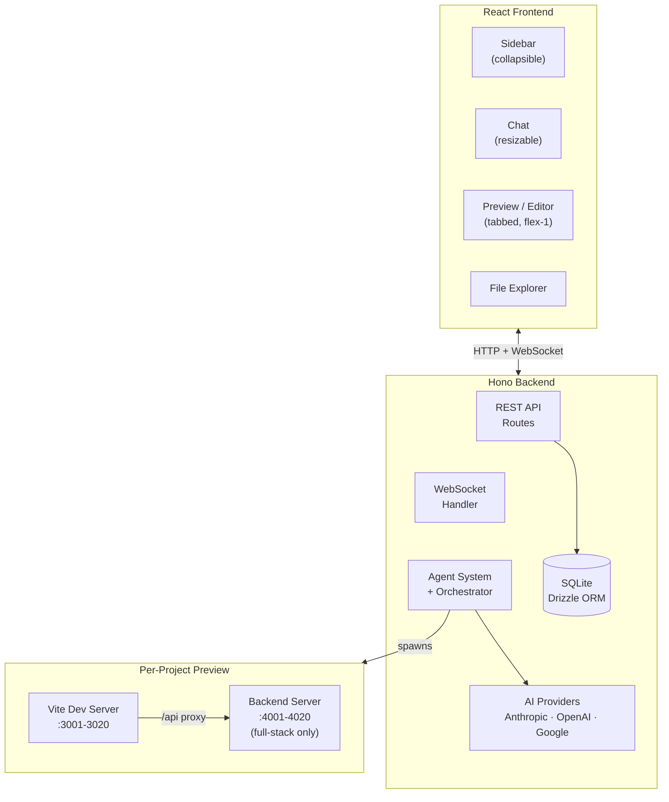

# Architecture

## System Overview

## Data Flow

1. User sends a message in the chat UI
2. Message is persisted and orchestration triggered atomically via `POST /api/messages/send`
3. Orchestrator begins execution
4. Orchestrator creates an execution plan and dispatches specialized agents
5. Each agent runs via `streamText` (AI SDK); chunks stream in real time
6. Per-agent thinking blocks appear in the chat UI — expandable cards showing live streaming output
7. Pipeline progress bar updates via `agent_status` WebSocket events
8. Agent outputs are collected internally — not shown to the user as separate messages
9. Agents write files to the project directory
10. Vite dev server detects changes and pushes HMR updates
11. Preview iframe re-renders with the new code (always visible side-by-side with chat)
12. After all agents complete, the orchestrator synthesizes a single markdown summary
13. Only the summary is saved as a chat message and displayed to the user (rendered as markdown)
14. Token usage is tracked for every AI API call and broadcast to the client in real time
15. Users can stop a running pipeline at any time; sending a new message resumes from the chat history

## Key Decisions

- See [ADR-001: Tech Stack](https://github.com/anthonybaldwin/page-gen/blob/main/docs/adr/001-tech-stack.md)
- API keys encrypted client-side (AES-GCM); ciphertext in localStorage, encryption key in IndexedDB; sent per-request via headers
- One Vite dev server per active project for isolated HMR
- All data is local (SQLite), no cloud dependency
- Chat pane is resizable (drag handle, min 320px, max 50% viewport, persisted to localStorage)
- Content area has tabbed Preview/Editor — both stay mounted (`forceMount`) so neither iframe nor CodeMirror instance is destroyed on tab switch
- File editor uses CodeMirror 6 with Nord color scheme, code-split into a separate vendor chunk (~220KB gzipped)
- WebSocket messages are coalesced in 50ms batches to reduce client re-renders
- Chat titles are auto-generated from the first user message via LLM

## UI Layout & Interaction

### Theme System
Three modes — Light, Dark, System — cycled via a toggle button in the sidebar footer (Sun / Moon / Monitor icons). Stored in `localStorage` under `"theme"`. System mode tracks `prefers-color-scheme` via `matchMedia` listener and auto-applies. Theme is applied by toggling the `dark` class on `document.documentElement`.

### Multi-File Editor
Tabbed editor built on CodeMirror 6 (Nord color scheme, code-split into a ~220KB gzipped vendor chunk). Features:
- Horizontal scrollable tab bar for all open files
- Middle-click closes a tab directly; hover reveals an X button
- "Close all" button appears when 2+ files are open
- White dot dirty indicator on unsaved files
- Closing the active tab auto-activates the nearest neighbor
- Active tab distinguished by a primary-colored bottom border

### Agent Status Panel
A horizontal pipeline progress bar in the chat header (`AgentStatusPanel.tsx`). Agent name buttons are connected by separator lines. Status icons:
- **Pending** — empty circle
- **Running** — spinning amber loader with elapsed time
- **Completed** — green checkmark with elapsed time
- **Failed** — red X
- **Retrying** — orange refresh icon

Clicking an agent name expands to show raw stream output. Shows phase labels (remediation, build-fix, re-review) and a test badge when applicable. Pipeline agents are populated dynamically from `agent_status` and `pipeline_plan` WebSocket events.

### Agent Thinking Blocks
Expandable cards in the chat timeline (`AgentThinkingMessage.tsx`). Each card shows:
- Header: status icon, agent display name, rotating activity phrase (animated every 3s), summary on completion
- Body: sanitized thinking content (strips tool calls and JSON artifacts, rendered as markdown), tool call log with letter badges (W = write, R = read, L = list), and a "Show raw output" toggle
- Test result blocks render as `TestResultsBanner` instead of thinking content

### Inline Test Results
`TestResultsBanner.tsx` renders inside the thinking block timeline:
- Summary: "All N tests passed" (green) or "X/Y passed, Z failed" (red) or "Running tests..." (amber)
- Expandable checklist grouped by suite file; each test shows status icon, name, and duration
- Clicking a failed test expands its error message in a preformatted block

### Project Management
Managed in the sidebar (`Sidebar.tsx`):
- **Create** — Plus button opens an inline input; press Enter to confirm
- **Rename** — Double-click the project name for inline editing; Enter or Escape to submit/cancel
- **Delete** — Trash icon on hover; confirmation dialog requires typing the project name

### File Explorer
`FileExplorer.tsx` in the sidebar with dual search modes:
- **Files** — Filename filter with 150ms debounce and fuzzy match highlighting
- **Content** — Full-text search via `GET /files/search/:projectId?q=` with 300ms debounce; shows file path, line number, and highlighted snippet

Actions: refresh button reloads the tree, download button triggers `GET /files/zip/:projectId` for ZIP export. File icons are color-coded by extension (tsx/ts/jsx/js/css/html/json).

### Markdown Rendering
Chat messages are rendered as GitHub Flavored Markdown via `react-markdown` with the `remark-gfm` plugin (`MarkdownContent.tsx`). Supports headings, lists, tables, code blocks (language-aware syntax highlighting), blockquotes, and links (open in new tab). Styled with Tailwind; code blocks use a dark background (Nord palette).

## Token Consumption Reduction

The orchestrator minimizes token usage through several strategies:

- **File manifests for tool-using agents:** Dev agent outputs (frontend-dev, backend-dev, styling) are converted to compact file manifests listing files written. Tool-using downstream agents (e.g., testing) can `read_file` if needed; review agents receive fresh source from disk instead.
- **Disk-based review:** Review agents (code-review, security, QA) receive fresh project source read from disk via `readProjectSource()` instead of upstream dev outputs, ensuring they see final state.
- **Targeted remediation filtering:** Remediation dev agents only receive review findings + architect output. Re-review agents get fresh source from disk.
- **Output truncation:** All upstream outputs are capped (15K chars default, 30–40K for project-source) with smart truncation (keep first + last, elide middle).
- **Chat history capping:** `buildPrompt()` keeps only the last 6 messages, capped at 3K chars total.
- **Pre-flight cost estimate:** Before each agent call, estimated input tokens are checked against 95% of the session limit. If exceeded, the agent is skipped.
- **Capped remediation:** `MAX_REMEDIATION_CYCLES = 2` — with better filtering, focused cycles are more effective than noisy repeats.
