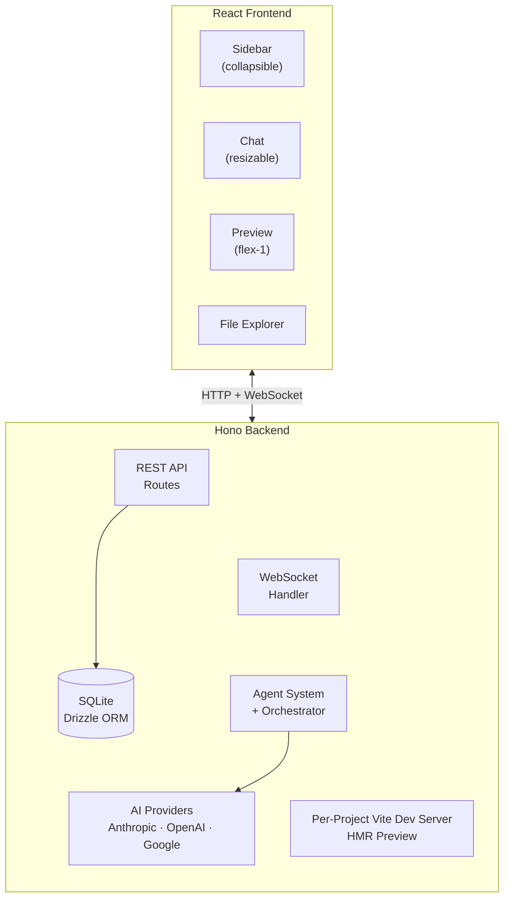

# Architecture

## System Overview

## Data Flow

1. User sends a message in the chat UI
2. Message is persisted and orchestration triggered atomically via `POST /messages/send`
3. Orchestrator begins execution
4. Orchestrator creates an execution plan and dispatches specialized agents
5. Each agent runs via `streamText` (Vercel AI SDK); chunks stream in real time
6. Per-agent thinking blocks appear in the chat UI — expandable cards showing live streaming output
7. Pipeline progress bar updates via `agent_status` WebSocket events
8. Agent outputs are collected internally — not shown to the user as separate messages
9. Agents write files to the project directory
10. Vite dev server detects changes and pushes HMR updates
11. Preview iframe re-renders with the new code (always visible side-by-side with chat)
12. After all agents complete, the orchestrator synthesizes a single markdown summary
13. Only the summary is saved as a chat message and displayed to the user (rendered as markdown)
14. Token usage is tracked for every AI API call and broadcast to the client in real time
15. Users can stop a running pipeline at any time; sending a new message resumes from the chat history

## Key Decisions

- See [ADR-001: Tech Stack](https://github.com/anthonybaldwin/just-build-it/blob/main/docs/adr/001-tech-stack.md)
- API keys stored in browser localStorage, sent per-request via headers
- One Vite dev server per active project for isolated HMR
- All data is local (SQLite), no cloud dependency
- Chat pane is resizable (drag handle, min 320px, max 50% viewport, persisted to localStorage)
- WebSocket messages are coalesced in 50ms batches to reduce client re-renders
- Chat titles are auto-generated from the first user message via LLM

## Token Consumption Reduction

The orchestrator minimizes token usage through several strategies:

- **File manifests for tool-using agents:** Dev agent outputs (frontend-dev, backend-dev, styling) are converted to compact file manifests listing files written. Downstream agents have tools to `read_file` if needed.
- **Disk-based review:** Review agents (code-review, security, QA) receive fresh project source read from disk via `readProjectSource()` instead of upstream dev outputs, ensuring they see final state.
- **Targeted remediation filtering:** Remediation dev agents only receive review findings + architect output. Re-review agents get fresh source from disk.
- **Output truncation:** All upstream outputs are capped (15K chars default, 40K for project-source) with smart truncation (keep first + last, elide middle).
- **Chat history capping:** `buildPrompt()` keeps only the last 6 messages, capped at 3K chars total.
- **Pre-flight cost estimate:** Before each agent call, estimated input tokens are checked against 95% of the session limit. If exceeded, the agent is skipped.
- **Capped remediation:** `MAX_REMEDIATION_CYCLES = 2` — with better filtering, focused cycles are more effective than noisy repeats.
