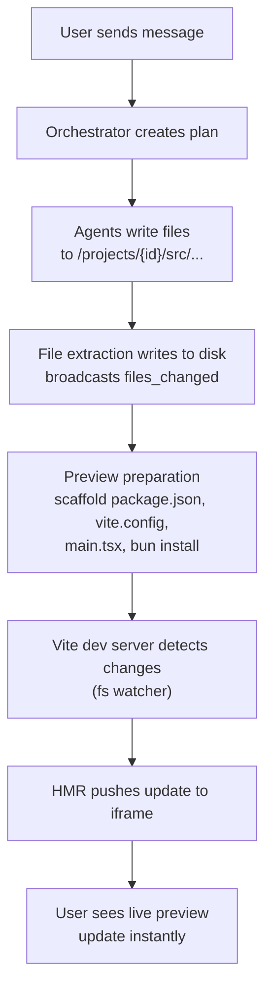

# HMR Live Preview

## Overview

Users see their page update live in the preview as agents write/modify files during a chat session.

## Flow

## Implementation

### Per-Project Vite Dev Server
- Each active project gets its own Vite dev server on a unique port (3001, 3002, ...)
- Server is started lazily when the preview component mounts (always visible in the side-by-side layout)
- The preview iframe points to `localhost:{port}`

### Auto-Scaffolding

When preview is triggered (by the orchestrator after first file extraction, or when the preview component mounts for an active project), the system ensures:

1. **`package.json`** exists with `react`, `react-dom`, `vite`, `@vitejs/plugin-react`
2. **`vite.config.ts`** includes the React plugin for JSX/TSX transformation
3. **`index.html`** entry point exists pointing to `./src/main.tsx`
4. **`src/main.tsx`** exists as the React entry point (auto-detects App component)
5. **`bun install`** is run to install dependencies into `node_modules`

Agent-generated `package.json` is merged — any deps the agent specifies are preserved, and core React deps are added if missing.

### File Extraction → Preview

After each file-producing agent completes (`frontend-dev`, `backend-dev`, `styling`):
1. Agent text output is parsed for `<tool_call>` write_file calls
2. Files are written to disk via `file-ops.ts`
3. `files_changed` WebSocket event is broadcast
4. After the **first** file-producing agent, `prepareProjectForPreview()` runs in the background (scaffold + install)
5. When prep completes, `preview_ready` WebSocket event is broadcast

### File Change → HMR
- When agents write/modify files via the `file-ops` tool, Vite's built-in file watcher detects the change
- Vite sends HMR updates over WebSocket to the iframe
- The iframe re-renders with updated code — no full page reload needed

### Pipeline-Aware Preview Gating

The preview component tracks whether the pipeline is running via `agent_status` WS events:

- **Pipeline running:** `files_changed` events are **ignored** — preview does NOT reload. This prevents showing broken/corrupted state while agents are mid-write and build hasn't passed yet.
- **Pipeline idle:** `files_changed` events reload the preview as a fallback (HMR should handle most cases).
- **`preview_ready` events** always trigger a reload regardless of pipeline state. These are only sent after a successful build check.

This prevents the preview from flashing broken content when agents write files that haven't been build-checked yet.

### Preview Iframe Security
- iframe uses `sandbox="allow-scripts allow-same-origin allow-forms"`
- No access to parent app's localStorage, cookies, or DOM
- Completely isolated execution environment

### Server Lifecycle
- Servers are started on-demand via `POST /api/files/preview/{projectId}`
- `startPreviewServer()` runs full scaffolding before spawning Vite
- Servers are cleaned up when the project is closed or the app exits
- Port pool: 3001-3020 with automatic reuse — stopped servers release their port back to the pool
- Port readiness is verified by polling before returning the URL

### Docker Support
- When `PREVIEW_HOST` env var is set (e.g., `0.0.0.0`), Vite binds to that address instead of `localhost`
- URLs returned to the client always use `localhost` (browser connects through Docker port mapping)
- See [Docker](Docker) for full containerization details

## Troubleshooting

- **Preview shows blank:** Check if `src/main.tsx` exists and imports the correct App component
- **JSX errors:** Verify `vite.config.ts` includes `@vitejs/plugin-react`
- **Module not found:** Check that `bun install` ran successfully in the project directory
- **HMR not working:** Verify Vite config exists in the project directory
- **Port conflict:** Check if another process is using the assigned port
