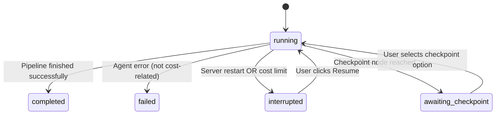

# Pipeline Resume

## Overview

When the server restarts mid-pipeline, all in-flight agent work is lost because pipeline state (abort controllers, agent results) lives in memory. The pipeline resume feature persists enough state to the database so that interrupted pipelines can pick up where they left off instead of starting from scratch.

## How It Works

### Pipeline Run Tracking

Every pipeline execution creates a row in the `pipeline_runs` table:

| Column | Type | Description |
|--------|------|-------------|
| `id` | TEXT PK | Unique run identifier |
| `chat_id` | TEXT FK | Chat this pipeline belongs to |
| `intent` | TEXT | "build", "fix", or "question" |
| `scope` | TEXT | "frontend", "backend", "styling", or "full" |
| `user_message` | TEXT | The original user message that triggered the pipeline |
| `planned_agents` | TEXT | JSON array of agent names in the execution plan |
| `status` | TEXT | "running", "completed", "failed", "interrupted", or "awaiting_checkpoint" |
| `checkpoint_data` | TEXT | JSON string of checkpoint options (nullable) |
| `started_at` | INTEGER | Unix timestamp (ms) |
| `completed_at` | INTEGER | Unix timestamp (ms), null while running |

### Status Transitions



### Server Restart Cleanup

On server startup, `cleanupStaleExecutions()` now also marks all `running` pipeline_runs as `interrupted`. This makes them discoverable by the client and the resume endpoint.

### Resume Flow

1. Client detects an interrupted pipeline (via `/agents/status` returning `interruptedPipelineId`)
2. User clicks "Resume" → client sends `POST /agents/run` with `{ resume: true }`
3. Server calls `findInterruptedPipelineRun(chatId)` to get the pipeline run ID
4. `resumeOrchestration()` loads the pipeline_run row and reconstructs state:
   - Loads all **completed** agent_executions for the chat
   - Parses each execution's `output` JSON to extract `.content`
   - Rebuilds the `agentResults` Map from completed agents
   - Rebuilds the execution plan using the same intent/scope
   - Filters the plan to skip agents already in `agentResults`
5. Broadcasts `pipeline_plan` and completed agent statuses so the UI updates
6. Executes only the remaining pipeline steps
7. Runs the standard finish pipeline (remediation + build check + summary)

### Edge Cases

- **Research not completed (build mode):** Cannot resume — falls back to a fresh start
- **No interrupted pipeline found:** Falls back to a fresh start (same as `resume: false`)
- **All agents completed:** Skips straight to the finish pipeline (remediation + summary)
- **Cost limit still exceeded on resume:** The resume pre-check validates the per-chat token limit; daily and project cost limits are re-checked during pipeline step execution. If still over, aborts with `errorType: "cost_limit"` telling the user to increase limits.

### Cost Limit Resume Flow

When the token limit is reached mid-pipeline:

1. `executePipelineSteps()` broadcasts an `agent_error` with `errorType: "cost_limit"`
2. The caller marks the pipeline as `"interrupted"` (not `"failed"`) so it's resumable
3. Client shows an **amber banner** (not red error) with "Token limit reached. Pipeline paused."
4. User clicks **"Increase limit & resume"** → inline `LimitsSettings` panel appears
5. After adjusting limits and clicking **"Resume pipeline"**, the existing resume flow kicks in
6. `resumeOrchestration()` re-checks the cost limit — if still over, aborts with a clear message

## Client UX

### Server Restart Interruption

When a pipeline is interrupted by a server restart, the chat shows an amber banner with three options:

1. **Resume** (primary, amber button) — Picks up from the last completed agent
2. **Retry from scratch** (secondary, subtle link) — Runs a fresh pipeline
3. **Dismiss** — Hides the banner

### Cost Limit Interruption

When the token limit is reached mid-pipeline, the chat shows an amber banner with:

1. **"Increase limit & resume"** — Toggles an inline LimitsSettings panel
2. **"Resume pipeline"** (green button, appears after adjusting limits) — Triggers the resume flow
3. **Dismiss** — Hides the banner

The `/agents/status` endpoint now returns `interruptedPipelineId` so the client can detect interrupted pipelines on load.

## API Changes

### POST /agents/run

Now accepts an optional `resume` flag:

```json
{ "chatId": "...", "message": "...", "resume": true }
```

- `resume: true` — Look for an interrupted pipeline and resume it
- `resume: false` or omitted — Start a fresh pipeline (but see auto-resume below)

**Auto-resume:** `runOrchestration()` checks for interrupted pipelines before classifying intent. If one is found, it auto-resumes regardless of the `resume` flag. This prevents follow-up messages from being classified as new build requests.

**Alternative endpoint:** `POST /messages/send` also accepts the `resume` flag with identical behavior (combines message persistence + orchestration in a single call).

### GET /agents/status

Response now includes:

```json
{
  "running": false,
  "executions": [...],
  "interruptedPipelineId": "abc123"  // or null
}
```
